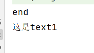
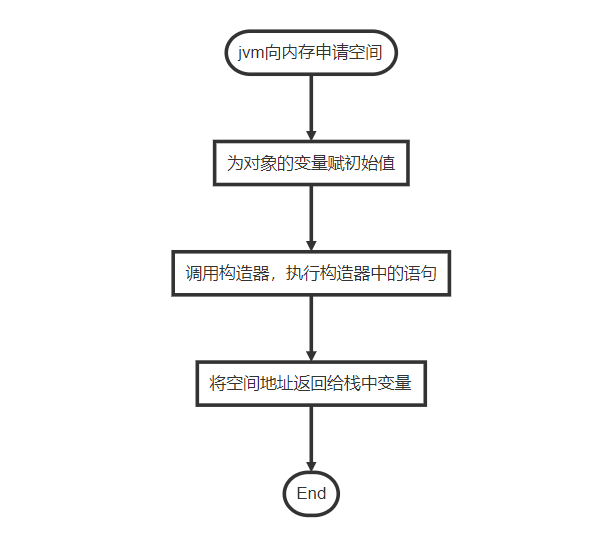
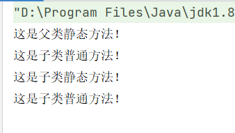

# 上课记录

## 1、idea快捷键

* Alt+shift+上下键：将光标选中部分上下移动
* Alt+shift+M：将代码块封装成方法
* Alt+shift+t：快速创建方法
* ctrl+r：查找替换

## 2、设计程序时遵循事项

* if尽量使用短路语法，使程序快速回到正轨；
* 低耦合，高聚合
* 将重复的代码逻辑抽象成一个方法，封装起来

## 3、一些理论性知识

* class.变量 = value;与class.set变量(value);的区别，调用方法能够让程序认知到值的改变，而用 . 来调用的话，程序不能认知到值的改变
* 回答问题时

  * 是什么？
  * 优点，缺点
  * 如果有多个名词，说明他们之间的联系

## 4、数据类型

java中分为两种类型，基本数据类型（值类型）和引用类型

基本数据类型就不说了，我们来研究一下引用类型，一个非常典型的例子`对象` 它就是引用数据类型

当我们执行以下语句：

~~~java
public class Text{
    String str = "start";

    void change(Text text){
        text.str = "end";
    }

    String  getStr1(){
        return str;
    }
    
    void setStr1(String str){
        this.str = str;
    }

    public static void main(String[] agrs){
        Text text;
        text = new Text();
        
        //测试方法传参为地址还是值
        text.change(text);
        System.out.println(text.getStr1());

        
        
        //测试赋值过程中使用的是地址还是值
        Text text1;
        text1 = new Text();
        text = text1;
        text1.setStr1("这是text1");
        System.out.println(text.getStr1());
        
    }
}
~~~

程序运行结果：

从上面代码我们可以看出，引用类型持有的是实例的地址，当它进行传递时传递的是地址；当地址指向的值发生改变时，所有持有该地址引用的变量的值都会发生改变

>有一个特殊的引用类型：`String`，本来我是准备用它做例子说明引用类型在传递过程中是传的地址（虽然String传的也是地址，但底层逻辑有点不一样），而不是传的值；我会在下面专门开一个标题说一下我对`String`类型的初步了解

说到数据类型，我们就需要引入两个内存的概念，栈和堆，这两个东西可以帮助你来理解何为地址，何为值

* 值：对基本数据类型而言，值就是它存储的数据；对引用类型而言，值是它持有的地址所指向的空间中存储的数据
* 地址：地址是对引用类型而言，是引用类型变量实际上持有的数据；

**栈是程序执行的地方，也是存储基本数据类型的地方；**

**堆是用来存放对象和数组的实例的，我们平时用的`new`就是在堆中开辟空间;**

凭我的三言两语可能并不能让你们理解到栈和堆，这里我推荐你可以去看看《[java中的栈与堆](https://www.cnblogs.com/ibelieve618/p/6380328.html)》

### 4.1String专题

首先我们知道String是一个引用类型

那么把它作为形参传入方法，然后在方法里改变它的值，它本身的值会改变吗?

答案：是不会

想必有些人已经开始跟我一样懵逼了吧，String是引用类型啊，传地址，改值不应该本身也会变吗

然后我在网上查阅了一些资料发现是jvm搞得鬼，因为String类型我们用的太多了，jvm为了提高性能和减少内存

的开销，在对字符串实例化时进行了一些优化，它在内存中划分了一个名为**字符串常量池**的空间，**每当我们创建字  符串常量时，JVM会首先检查字符串常量池，如果该字符串已经存在常量池中，那么就直接返回常量池中的实例引用。如果字符串不存在常量池中，就会实例化该字符串并且将其放到常量池中。**

> 比如我们令`String str = "a";`那么jvm会检索字符串常量池，如果发现有相同的对象（一个字符串便是一个变量），那么它会将已经存在的对象的地址返回给str持有，如果没有检索到相同对象那么它会实例化一个”a“，然后将它存入字符串常量池中去

我浅薄的理解应该无法满足你的求知欲，这里有一个写的比较好的博客，可以去看看

《[深入理解java中的String类](https://www.cnblogs.com/xiaoxi/p/6036701.html)》

## 5、关于对象的创建

* 对象创建的过程

   ​                    `A a =new A();`

   * 第一步：jvm先向内存（堆）中申请一个空间
   * 第二步：为对象的变量赋予初值，如果没有给初始值，那么jvm会为变量提供默认值，int默认值为0；boolean默认值为false，引用类型默认值为NULL
   * 第三步：jvm会调用构造器，执行构造器中的语句
   * 第四步：jvm将开辟出来的空间地址交予栈中某一变量持有

   

     

   > 如果你理解了对象的创建，那么你就能推断出一些有趣的结论
   >
   > 1、实例的成员变量会比构造器先执行，与代码所写前后位置无关，即：成员变量写在构造器后面也是成员变量先赋初始值，再经过构造器赋值；
   >
   > 2、栈中变量持有的是实例的地址，而不是实例本身；
   >
   > 3、值得注意的一点是：如果有static修饰符，对象实例话的情况又会有所不同，这一点我会在下面讲到static时提出

## 6、关于封装

封装可以对类封装也可以对方法封装，

* 对类封装，将类的两个要素包装到一个单元里
* 对方法封装，将具有相同功能或相同逻辑的代码块抽取出来，包装成一个方法
* 说到封装就离不开抽象，抽象就是把一个具体的东西简单化，只留下一个由主要特征构成的概念性事物。
* 抽象也体现在当我们使用一个类型的实例的时候，在调用其方法时，只需要关注有哪些入参，可以得到什么返回，而无需关注内部的具体实现方式或细节

>关于封装我的一些理解：
>
>1、封装，根据字面意思即可以知道，它是将一堆东西装在一起，封闭起来。而应用到编程中，就会产生几个令人思考的点，一堆什么东西，装在哪里，如何才是封闭起来？
>
>2、一堆东西大概是指拥有相同特征或行为的事物，或者一种特定的行为模式
>
>3、装在哪里：在现实生活中我们会将东西打包起来装在盒子中，而java程序中有与之代替的东西，那就是类/方法，我们将拥有相同特征或行为的事物装在类中，而特定的行为模式装在方法中
>
>4、如何才是封闭起来：我理解为让别人看到你想让他看到的东西，就像人慢慢的长大后，会从小时候的童言无忌到现在的察颜悦色，这就是我们将带刺的自己封装后的结果
>
>
>
>值得一提的是，提到封装他就离不开抽象，当你去提炼 **"一堆东西"** 的时候你往往会将与这堆东西并不是那么相关的杂志去除掉，留下来的便是这堆东西的精髓，这也就是我们常说的“关注主要的，忽略次要的”

## 7、关于继承

* 子类继承父类中除private修饰的成员

* 子类可以重写父类方法

* 子类在new的时候是先创建父类对象，再创建子类对象，在创建父类和子类时遵循对象创建的过程

  即：先赋值，再调用构造器，类中的static成员会在jvm加载时就完成创建；所以static优先，父类第二，子类最后

* java只能单继承，但可以通过多级继承来实现间接的多继承

> 关于继承：
>
> 通过反编译子类我们可以得知它的运行过程（Javap -v xxx.class）

~~~class
D:\qian-feng-study\target\classes\project\com\Test>javap -v Childs.class

Classfile /D:/qian-feng-study/target/classes/project/com/Test/Childs.class
  Last modified 2022-7-15; size 609 bytes
  MD5 checksum 0673524492c304d227e3b0ec4536b50e
  Compiled from "Super.java"
class project.com.Test.Childs extends project.com.Test.Super
  minor version: 0
  major version: 52
  flags: ACC_SUPER
Constant pool:
1 = Methodref          #7.#19         // project/com/Test/Super."<init>":()V
2 = Fieldref           #20.#21        // java/lang/System.out:Ljava/io/PrintStream;
3 = String             #22            // 这是子类静态方法！
4 = Methodref          #23.#24        // java/io/PrintStream.println:(Ljava/lang/String;)V
5 = String             #25            // 这是子类普通方法！
6 = Class              #26            // project/com/Test/Childs
7 = Class              #27            // project/com/Test/Super
8 = Utf8               <init>
9 = Utf8               ()V
10 = Utf8               Code
11 = Utf8               LineNumberTable
12 = Utf8               LocalVariableTable
13 = Utf8               this
14 = Utf8               Lproject/com/Test/Childs;
15 = Utf8               m1
16 = Utf8               m2
17 = Utf8               SourceFile
18 = Utf8               Super.java
19 = NameAndType        #8:#9          // "<init>":()V
20 = Class              #28            // java/lang/System
21 = NameAndType        #29:#30        // out:Ljava/io/PrintStream;
22 = Utf8               这是子类静态方法！
23 = Class              #31            // java/io/PrintStream
24 = NameAndType        #32:#33        // println:(Ljava/lang/String;)V
25 = Utf8               这是子类普通方法！
26 = Utf8               project/com/Test/Childs
27 = Utf8               project/com/Test/Super
28 = Utf8               java/lang/System
29 = Utf8               out
30 = Utf8               Ljava/io/PrintStream;
31 = Utf8               java/io/PrintStream
32 = Utf8               println
33 = Utf8               (Ljava/lang/String;)V
{

  project.com.Test.Childs();
  
    descriptor: ()V
    flags:
    Code:
      stack=1, locals=1, args_size=1
         0: aload_0
         1: invokespecial #1             // Method project/com/Test/Super."<init>":()V
         4: return
      LineNumberTable:
        line 13: 0
      LocalVariableTable:
        Start  Length  Slot  Name   Signature
            0       5     0  this   Lproject/com/Test/Childs;
            
  static void m1();
    descriptor: ()V
    flags: ACC_STATIC
    Code:
      stack=2, locals=0, args_size=0
      0: getstatic     #2   // Field java/lang/System.out:Ljava/io/PrintStream;
      3: ldc           #3   // String 这是子类静态方法！
      5: invokevirtual #4   // Method java/io/PrintStream.println:(Ljava/lang/String;)V
      8: return
   LineNumberTable:
      line 15: 0
      line 16: 8
      
  void m2();
    descriptor: ()V
    flags:
    Code:
      stack=2, locals=1, args_size=1
      0: getstatic     #2  // Field java/lang/System.out:Ljava/io/PrintStream;
      3: ldc           #5  // String 这是子类普通方法！
      5: invokevirtual #4  // Method java/io/PrintStream.println:(Ljava/lang/String;)V
      8: return
  LineNumberTable:
      line 19: 0
      line 20: 8
  LocalVariableTable:
      Start  Length  Slot  Name   Signature
          0       9     0  this   Lproject/com/Test/Childs;
}

SourceFile: "Super.java"
~~~

> 从上面反编译得到的代码我们可以看出，子类实例化时会先实例化一个父类，而且从反编译的代码中我们能推断出子类实例化时是持有一个父类实例地址（这个非常隐蔽，只能用super来调用）
>
> 那么结合上面所提到的对象的创建，我们是不是可以得出一个执行顺序：
>
> 1、父类成员变量执行
>
> 2、父类构造器执行
>
> 3、子类成员变量执行
>
> 4、子类构造器执行

## 8、向上转型&&向下转型

* 向上转型：子类转型为父类，自动转型
* 向下转型：父类转型为子类，强制转型

无论是向上转型还是向下转型，对象地址指向的空间是由new 后面的构造器决定的

前面的引用类型用来规定对象可以用什么

> 总结：能做什么看左边，有什么看右边

## 9、final修饰词

* 被final修饰的变量，具有 “ 不可改变 ” 的特性
* 修饰基本类型：其值不可改变
* 修饰引用类型：储存的地址不可改变，但地址指向的值可以改变
* 修饰类：表示这个类为最终版，不可被继承
* 修饰方法：表示这个方法为最终版，不可被重写
* final修饰的变量可以在构造器中进行第一次赋值初始化，如果已经初始化赋值过了，那么就不能在构造器中赋值

## 10、static修饰词

* 由static修饰的成员，不依赖类的实例而存在，一般直接通过类名调用，他是这个类的实例所共有的

* 被static修饰的成员为静态成员，有且只有一份并在jvm加载过程中就已经生成
* 当方法被static修饰时，该方法不可以使用非静态成员
* 当子类重写父类static方法后，**具体实现方法根据实例的类型**来确定，如下：

~~~java
public class Super{
    static void m1(){
        System.out.println("这是父类静态方法！");
    }
    
    void m2(){
        System.out.println("这是父类普通方法！");
    }
}

class Child{
    static void m1(){
        System.out.println("这是子类静态方法！");
    }
    
    void m2(){
        System.out.println("这是子类普通方法！");
    }
}

class test{
    public static void main(String[] args){
        //子类转为父类，向上转型
        Super sup = new Child();
        
        sup.m1();//实例类型为父类，调用父类静态方法
        sup.m2();//new的为子类空间，故调用子类重写后的方法
        
        //父类转为子类，向下转型
        Child child = (Child)sup;
        
        child.m1();//实例类型为子类，调用子类静态方法
        child.m2();//由于地址没发生改变，故实例指向的空间也没变，所以还是调用子类方法
       
    }
}
~~~

程序运行结果为：

## 11、对象的比较

这个没啥好解释的就是重写Object提供的equals方法由比较地址改为比较值，然后加入一些防出错判断，不过引入了一个新的关键字`A instanceof B`用于查看A对象是否为B类型代码如下

~~~java
public boolean equals(Object obj) {

        // 用短路思路来编写：让程序尽早返回结果 / 让不合格的元素尽早退出该段逻辑

        if (obj == null) return false;
        Point point;
        if (!(obj instanceof Point)) return false;
        point = (Point) obj;
        return (x == point.x && y == point.y);

    }
~~~

## 12、关于多态

**多态，多种形态或形式，即允许一个对象有多种体现形式。**

向上转型很好的体现了多态，一个父类型的形参能够接受许许多多子类型的是实参，从而让程序在不改变代码结构的情况下运行出来不同的结果

## 13、abstract 抽象类

**所谓的抽象类，就是我们不想具体化一个类型所封装出来的类型**

​	1、不能实例化的

​	2、抽象类存在的意义，他就是用来被继承或扩展的

​	3、抽象类中不一定有抽象方法，但是有抽象方法一定它就是抽象类

​	4、抽象类中也可以有具体的方法

​	5、抽象类的子类不一定非要实现父类型中的抽象方法，它可以继续声明自己也是抽象的

​	6、没有具体实现（方法体）的方法称之为抽象方法

